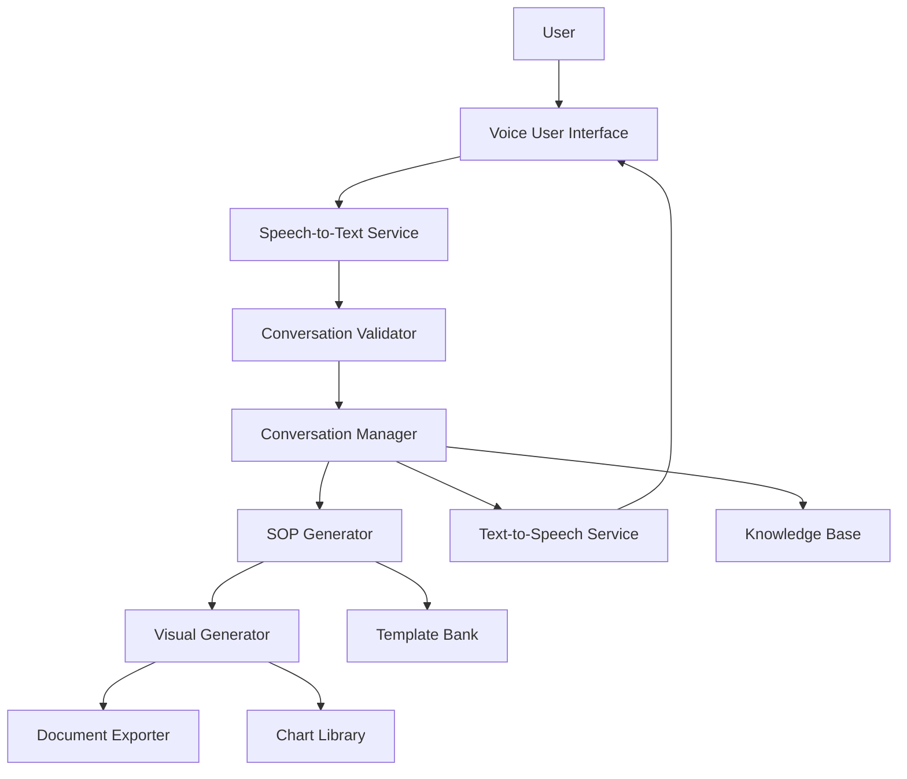
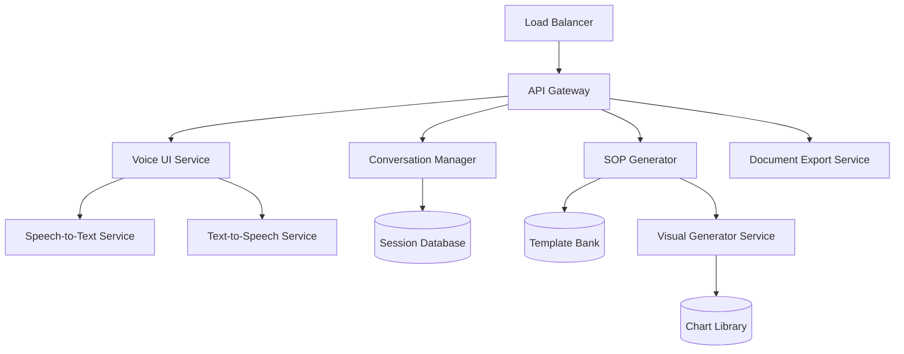

# AI Voice SOP Agent - Design Document

## Overview

The AI Voice SOP Agent is a conversational system that transforms voice-based workflow descriptions into comprehensive Standard Operating Procedures. The system combines real-time speech transcription, AI-powered conversation management, and intelligent SOP generation with visual modeling capabilities. The architecture supports iterative refinement through natural conversation while ensuring accuracy through transcription validation.

## Architecture

### High-Level Architecture



### System Components

1. **Voice User Interface (VUI)**: Manages audio input/output and user interaction
2. **Speech-to-Text Service**: Converts voice to text with confidence scoring
3. **Conversation Validator**: Validates transcription accuracy and manages corrections
4. **Conversation Manager**: Orchestrates dialogue flow and maintains session context
5. **SOP Generator**: Creates structured SOPs from validated workflow information
6. **Visual Generator**: Creates business modeling charts and diagrams
7. **Document Exporter**: Formats and exports final SOPs in multiple formats
8. **Text-to-Speech Service**: Provides audio feedback and SOP reading capabilities

## Components and Interfaces

### Voice User Interface (VUI)

**Responsibilities:**
- Capture audio input from microphone
- Stream audio to Speech-to-Text service
- Play audio responses from Text-to-Speech service
- Manage audio session state

**Interfaces:**
```typescript
interface VoiceUserInterface {
  startListening(): Promise<void>
  stopListening(): Promise<void>
  playAudio(audioData: AudioBuffer): Promise<void>
  onAudioInput(callback: (audioStream: AudioStream) => void): void
}
```

### Speech-to-Text Service

**Responsibilities:**
- Convert audio streams to text in real-time
- Provide confidence scores for transcribed segments
- Handle multiple language support
- Manage transcription sessions

**Interfaces:**
```typescript
interface SpeechToTextService {
  transcribe(audioStream: AudioStream): Promise<TranscriptionResult>
  getConfidenceScore(segment: string): number
  setLanguage(language: string): void
}

interface TranscriptionResult {
  text: string
  confidence: number
  segments: TranscriptionSegment[]
  timestamp: Date
}
```

### Conversation Manager

**Responsibilities:**
- Orchestrate conversation flow and dialogue management
- Maintain session context and conversation history
- Implement the 5-iteration checkpoint logic
- Manage workflow information gathering
- Coordinate with SOP Generator for content creation

**Interfaces:**
```typescript
interface ConversationManager {
  startSession(userId: string): Promise<SessionId>
  processUserInput(sessionId: SessionId, input: UserInput): Promise<ConversationResponse>
  generateSummary(sessionId: SessionId): Promise<WorkflowSummary>
  checkIterationLimit(sessionId: SessionId): boolean
  finalizeWorkflow(sessionId: SessionId): Promise<WorkflowDefinition>
}

interface ConversationResponse {
  message: string
  requiresConfirmation: boolean
  suggestedActions: string[]
  shouldReadAloud: boolean
}
```

### SOP Generator

**Responsibilities:**
- Generate structured SOPs from workflow definitions
- Apply appropriate templates based on SOP type
- Include risk assessment and quality checkpoints
- Coordinate with Visual Generator for chart creation

**Interfaces:**
```typescript
interface SOPGenerator {
  generateSOP(workflow: WorkflowDefinition, type: SOPType): Promise<SOPDocument>
  validateSOPCompleteness(sop: SOPDocument): ValidationResult
  updateSOP(sop: SOPDocument, changes: SOPChanges): Promise<SOPDocument>
}

interface SOPDocument {
  id: string
  title: string
  type: SOPType
  sections: SOPSection[]
  charts: ChartDefinition[]
  metadata: SOPMetadata
}
```

### Visual Generator

**Responsibilities:**
- Create business modeling charts (flowcharts, event diagrams, process maps)
- Generate visual representations of workflow steps
- Support multiple chart formats and export options

**Interfaces:**
```typescript
interface VisualGenerator {
  generateFlowchart(workflow: WorkflowDefinition): Promise<ChartDefinition>
  generateEventDiagram(events: EventSequence[]): Promise<ChartDefinition>
  generateProcessMap(process: ProcessDefinition): Promise<ChartDefinition>
  exportChart(chart: ChartDefinition, format: ChartFormat): Promise<ChartExport>
}
```

## Data Models

### Core Data Structures

```typescript
// Session and Conversation Models
interface ConversationSession {
  id: SessionId
  userId: string
  startTime: Date
  currentState: ConversationState
  iterationCount: number
  workflowSummary: WorkflowSummary
  transcriptionHistory: TranscriptionResult[]
}

interface WorkflowDefinition {
  id: string
  title: string
  description: string
  type: WorkflowType
  steps: WorkflowStep[]
  inputs: WorkflowInput[]
  outputs: WorkflowOutput[]
  dependencies: WorkflowDependency[]
  risks: RiskAssessment[]
}

// SOP Models
interface SOPSection {
  id: string
  title: string
  content: string
  type: SectionType
  order: number
  charts: ChartReference[]
  checkpoints: QualityCheckpoint[]
}

interface ChartDefinition {
  id: string
  type: ChartType
  title: string
  data: ChartData
  styling: ChartStyling
  exportFormats: ChartFormat[]
}

// Validation Models
interface ValidationResult {
  isValid: boolean
  errors: ValidationError[]
  warnings: ValidationWarning[]
  suggestions: string[]
}
```

### Enumerations

```typescript
enum SOPType {
  AUTOMATION = 'automation',
  PROCESS_IMPROVEMENT = 'process_improvement',
  TRAINING = 'training'
}

enum ChartType {
  FLOWCHART = 'flowchart',
  EVENT_DIAGRAM = 'event_diagram',
  PROCESS_MAP = 'process_map',
  SWIMLANE = 'swimlane',
  DECISION_TREE = 'decision_tree'
}

enum ConversationState {
  INITIAL_DESCRIPTION = 'initial_description',
  GATHERING_DETAILS = 'gathering_details',
  VALIDATION = 'validation',
  REFINEMENT = 'refinement',
  FINALIZATION = 'finalization'
}
```

## Error Handling

### Transcription Error Handling

1. **Low Confidence Detection**: When transcription confidence falls below 70%, request user confirmation
2. **Audio Quality Issues**: Detect poor audio quality and request user to repeat or adjust microphone
3. **Language Detection**: Automatically detect language switches and adapt accordingly
4. **Timeout Handling**: Manage silence periods and prompt user for continuation

### Conversation Error Handling

1. **Context Loss**: Implement conversation recovery mechanisms when context is lost
2. **Ambiguity Resolution**: Use clarifying questions to resolve unclear workflow descriptions
3. **Iteration Overflow**: Handle cases where users exceed the 5-iteration limit gracefully
4. **Session Timeout**: Manage long sessions with periodic saves and recovery options

### SOP Generation Error Handling

1. **Incomplete Information**: Identify missing workflow elements and prompt for completion
2. **Template Matching**: Handle cases where workflow doesn't fit standard templates
3. **Chart Generation Failures**: Provide fallback options when visual generation fails
4. **Export Errors**: Manage document export failures with alternative formats

## Testing Strategy

### Unit Testing

- **Component Isolation**: Test each component independently with mocked dependencies
- **Interface Compliance**: Verify all components implement their interfaces correctly
- **Data Validation**: Test data model validation and transformation logic
- **Error Scenarios**: Test error handling paths and edge cases

### Integration Testing

- **Service Communication**: Test inter-service communication and data flow
- **End-to-End Workflows**: Test complete user journeys from voice input to SOP export
- **Audio Pipeline**: Test the complete audio processing pipeline
- **Document Generation**: Test SOP and chart generation with various workflow types

### Performance Testing

- **Real-time Transcription**: Verify transcription latency meets real-time requirements
- **Conversation Response Time**: Ensure conversation responses are delivered within 2 seconds
- **SOP Generation Speed**: Test SOP generation performance with complex workflows
- **Concurrent Sessions**: Test system performance with multiple simultaneous users

### User Acceptance Testing

- **Voice Quality**: Test with various microphone qualities and background noise levels
- **Conversation Flow**: Validate natural conversation patterns and user experience
- **SOP Quality**: Verify generated SOPs meet business requirements and standards
- **Accessibility**: Test with users having different speech patterns and accents

## Security and Privacy Considerations

### Data Protection

- **Voice Data Encryption**: Encrypt all audio data in transit and at rest
- **Transcription Privacy**: Implement secure transcription processing with data retention policies
- **Session Isolation**: Ensure user sessions are properly isolated and secured
- **Export Security**: Secure document export and sharing mechanisms

### Compliance

- **GDPR Compliance**: Implement right to deletion and data portability for voice data
- **Industry Standards**: Ensure SOPs meet relevant industry compliance requirements
- **Audit Trails**: Maintain comprehensive audit logs for all system interactions
- **Access Controls**: Implement role-based access controls for SOP management

## Deployment Architecture

### Microservices Deployment



### Scalability Considerations

- **Horizontal Scaling**: Design services to scale horizontally based on demand
- **Caching Strategy**: Implement caching for templates, charts, and frequently accessed data
- **Queue Management**: Use message queues for asynchronous processing of SOP generation
- **CDN Integration**: Use CDN for static assets and generated document delivery